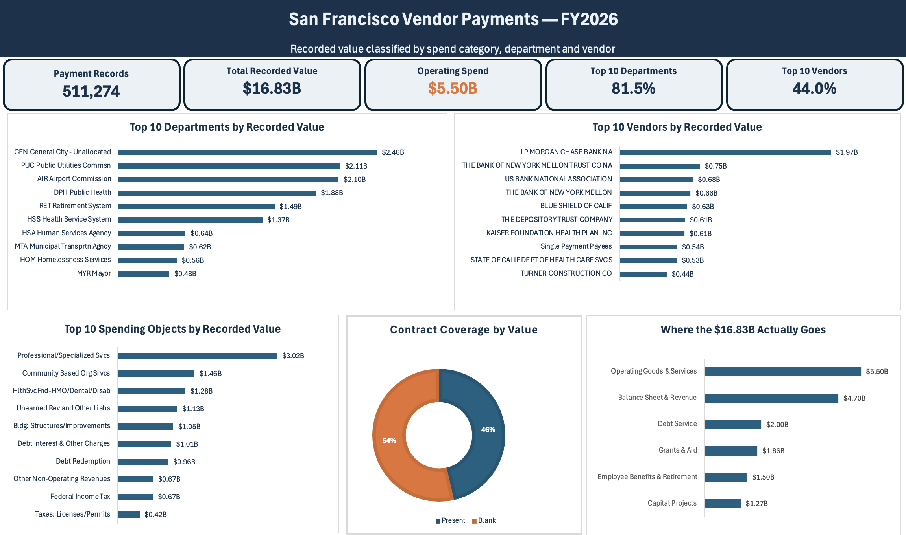

# San Francisco Vendor Payments — FY2026

**Of the $16.83B recorded in San Francisco's vendor payment file, only $5.50B is money the city spent buying goods and services.**

Built in Excel from 511,274 public payment records.



---

## The data

| | |
|---|---|
| Source | [DataSF — Vendor Payments (Vouchers)](https://data.sfgov.org/City-Management-and-Ethics/Vendor-Payments-Vouchers-/n9pm-xkyq), dataset `n9pm-xkyq` |
| Scope | Fiscal year 2026 |
| Records | 511,274 |
| Fields | 16 |
| Total recorded value | $16,830,575,715.20 |
| Extraction | Socrata API → filtered CSV → Power Query → Excel |

```
https://data.sfgov.org/resource/n9pm-xkyq.csv?$where=fiscal_year=2026&$limit=1000000
```

---

## The problem with reading this file as published

Rank the raw file and you get conclusions that are wrong:

| Naive reading | What it actually is |
|---|---|
| Largest vendor: **J P Morgan Chase, $1.97B** | Debt service, custody and payroll tax remittance. $1.33B of it is employee tax withholding passed through the bank. |
| Largest department: **General City – Unallocated, $2.46B** | An allocation bucket, not an operating department. |
| Top "spending objects" include **Unearned Revenue, Debt Redemption, Other Non-Operating Revenues** | Liability and revenue lines. Money coming in, or never spent. |

The file is titled *vendor payments*, but a large share of it is not procurement.

---

## Method

Every row was classified by its `character` field — San Francisco's own accounting
classification, 33 distinct values — into six spend categories.

| Category | Amount | Share |
|---|---|---|
| Operating goods & services | $5,496,930,960.76 | 32.7% |
| Balance sheet & revenue | $4,701,687,914.32 | 27.9% |
| Debt service | $1,995,802,007.55 | 11.9% |
| Grants & aid | $1,857,972,415.74 | 11.0% |
| Employee benefits & retirement | $1,504,088,751.91 | 8.9% |
| Capital projects | $1,274,093,664.92 | 7.6% |
| **Total** | **$16,830,575,715.20** | **100%** |

The full mapping of all 33 `character` values is in [`categories.csv`](categories.csv).
Nothing is unmapped.

---

## Findings

**1. Only a third of the file is procurement.**
$5.50B of $16.83B. The remainder is debt service, employee benefits, grants,
capital, and balance-sheet entries that were never purchases.

**2. Vendor concentration is far lower than the raw file suggests.**
Top-10 vendor share falls from 44.0% on the headline basis to 26.4% on operating
spend only. Strip out the banks and the real suppliers appear: UC Regents ($331M),
MWH/Webcor construction JV ($294M), CA Dept of Health Care Services ($234M).

**3. Department-level dependence is structural, not procurement risk.**

| Department | Top-5 vendor share, all rows | Top-5 share, operating only |
|---|---|---|
| PUC Public Utilities | 49% | 40% |
| DPH Public Health | 56% | 53% |
| AIR Airport Commission | 65% | 30% |
| MTA Transportation | 43% | 37% |
| DPW Public Works | — | 35% |
| RET Retirement System | 99% | n/a |
| HSS Health Service System | 98% | n/a |

Retirement System and Health Service System look extremely concentrated because
that is what those departments do — move money to custodians and health plans.
Where the city genuinely buys goods and services, no department depends on its
top five suppliers for more than about half its spend, and most sit near a third.

**4. $2.31B of the file is payroll tax withholding.**
23 objects carry raw general-ledger account codes (prefixes `230490`, `230750`,
`232660`, `232840`, `232880`) rather than readable labels. They are federal and
state income tax, OASDI, Medicare, disability insurance, deferred compensation
and union dues — 549 rows, three counterparties, roughly 27 rows each, matching a
biweekly payroll cadence. Labels are truncated at exactly 30 characters by the
source system.

---

## Verification

Every published figure reconciles to the full 511,274-row table:

- Sum of the six categories − grand total = **0** (within one cent; the residual
  is binary floating-point noise across half a million values)
- `SUM(paid) + SUM(pending)` = `SUM(total_payment)` at both aggregate and row level
- Row count check: `ROWS(DATA[total_payment])` = 511,274
- Field-level numeric checks: `COUNT(col) = ROWS(col)` for both amount columns
- Distinct-value counts recorded for vendors, departments, organization groups
  and spending objects

A `Data Profile` tab in the workbook holds all of these with PASS / INVESTIGATE
flags. It caught two totals that did not tie during the build — one was a column
formatted as Text, which had stored a formula as words instead of calculating it.

---

## Limitations

- **No time dimension.** Every row is FY2026 and no payment date is published, so
  no trend or year-over-year comparison is possible from this extract.
- **Pending is immaterial.** 508 rows of 511,274 carry a pending amount — 0.08% of
  value. It is reported for completeness, not as a finding.
- **`non_profit_indicator` is unusable.** One distinct value, blank on 472,151 rows.
  It measures form completion, not nonprofit status.
- **Duplicate rows retained.** 134,742 exact duplicates. These are legitimate
  repeated scheduled payments, not import errors, and removing them would
  understate real disbursements.
- **Vendor name casing left as published.** Five vendors appear under two
  capitalisations each; 6,520 vendor records represent 6,515 actual vendors.
- **One judgement call.** `Interest & Investment Income` ($2.06M) is grouped with
  Debt Service. It could defensibly sit in Balance Sheet & Revenue. Immaterial at
  0.01% of total.
- **"Non-operating" is not the same as "non-procurement."** Capital projects and
  purchased insurance within employee benefits are procurement. Only the $4.70B
  balance-sheet and revenue bucket is definitively not spending.

---

## Files

| File | |
|---|---|
| `dashboard.png` | The finished dashboard |
| `categories.csv` | All 33 `character` values mapped to six spend categories |
| `SF_Vendor_FY2026_Summary.xlsx` | Summary tables and category totals |

---

*Data published by the City and County of San Francisco under its open data
programme. Figures independently reconciled to the source extract.*
